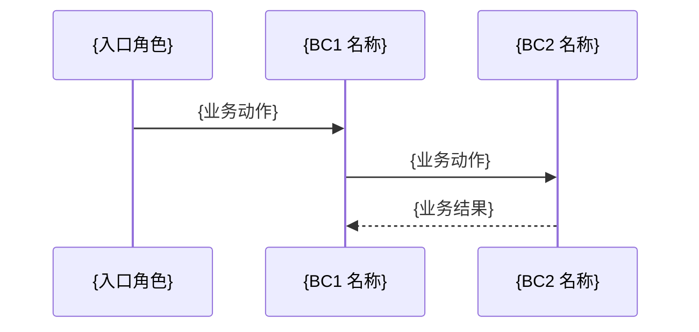

# 业务流程 — {BC 名称}

## 用例: {用例名称}

**用例 ID**: UC-{xx}-{yy}

### 入口点

| 用例入口<anchor:ddd> | 入口类型 | 代码锚点<anchor:code> | 业务触发<anchor:desc> |
|---------|---------|---------|---------|
| {唯一业务名称} | 应用服务/命令处理器/跨BC入站端口/周期任务/外部触发 | `{ServiceName}.{method}` | {什么业务场景触发} |

### 时序编排

| 步骤 | 业务动作<anchor:ddd> | 代码锚点<anchor:code> | 核心角色 / BC | 业务理由（WHY）<anchor:desc> |
|------|---------|---------|-------------|--------------|
| 1 | {业务动作} | `{ClassName}.{method}` | {本 BC / 对端 BC 名} | {为什么这一步存在} |
| 2 | {业务动作} | `{ClassName}.{method}` | {对端 BC 名} | {为什么需要这个 BC 参与} |

> 时序编排的代码锚点填该步的入口方法（`类名.函数名`）。若是跨类调用链，填入口方法，在"业务理由"中补充"调用链：A.method → B.method"。

### 失败/补偿矩阵

| 失败点<anchor:ddd> | 代码锚点<anchor:code> | 失败的业务后果 | 补偿动作 | 恢复原状态？ | 业务理由<anchor:desc> |
|--------|---------|--------------|---------|:-----------:|---------|
| {描述性失败名称} | `{ClassName}.{method}` | {业务上留下什么状态} | {业务上如何补偿} | 是/否 | {为什么这样补偿} |

### 时序图（可选）

