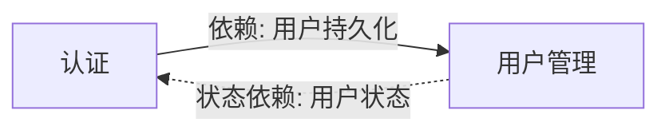

# 聚合协作视图 — 用户管理

## 1. 聚合根

| ID | 聚合根<anchor:ddd> | 代码锚点<anchor:code> | 持久化表 | 业务职责（一句话）<anchor:desc> | 业务入口概念？ |
|----|--------|---------|---------|------------------|:------------:|
| AG-01 | 用户 | `User` | `users` | 管理用户身份、凭证、档案与生命周期 | 是 |

## 2. 领域实体

N/A — 本 BC 仅有一个聚合根，无独立领域实体。

## 3. 值对象

| ID | 值对象<anchor:ddd> | 代码锚点<anchor:code> | 归属聚合 | 业务含义<anchor:desc> |
|----|--------|--------|---------|---------|
| VO-01 | 档案 | `Profile` | AG-01 | 用户展示信息：昵称、头像、简介 |

## 4. 聚合协作视图

| 聚合协作<anchor:ddd> | 源聚合 | 协作 | 目标聚合 | 代码锚点<anchor:code> | 业务性质<anchor:desc> | 业务触发条件 |
|----|------|----|---------|---------|---------|-------------|
| 认证注册用户 | 认证 | 依赖 | 用户管理 | `AuthService.register` | 认证服务创建用户时依赖用户管理的持久化承诺 | 新用户注册 |
| 认证查询用户 | 认证 | 依赖 | 用户管理 | `AuthService.login` | 登录时按邮箱查询用户并验证密码 | 用户登录 |

## 6. 行为归属与领域服务

**本 BC 的模型风格**: 充血

| 聚合/实体 | 代码锚点 | 行为位置 | 说明 |
|-----------|---------|---------|------|
| 用户 | `User` | 实体上（充血） | 状态变更逻辑在 User 上：register, suspend, reactivate, changePassword, updateProfile, delete |

### 领域服务

| ID | 领域服务<anchor:ddd> | 代码锚点<anchor:code> | 操作的聚合 | 业务行为<anchor:desc> | 业务规则 |
|----|--------|--------|-----------|---------|---------|
| DS-01 | 用户管理服务 | `UserService` | AG-01 | 编排用户的创建、查询、更新、挂起、恢复、删除 | 邮箱唯一性校验；状态转换规则 |
