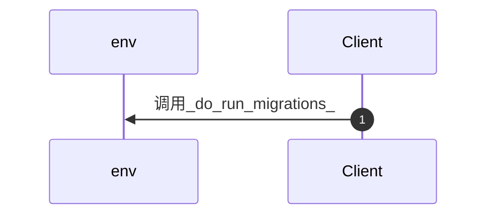

# do_run_migrations()（特性下钻）

## 01 特性概览

本特性对应业务流「do_run_migrations()」，入口 do_run_migrations()()。主路径经过 1 个模块：env。

## 02 关键技术点

## 03 核心实现

## 04 性能设计

- 调用深度 1 跳，跨 1 个模块。

## 05 可靠性设计

- 主路径未扫描到显式 throw/raise。

## 06 已知限制与验证

- 未扫描到 TODO/FIXME/HACK 标记。
- 未发现引用本特性符号的测试文件。
